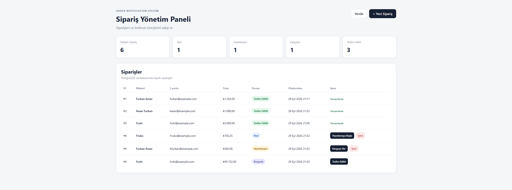

# Order Notification System

Full-stack order management and notification system built with **Spring Boot, React, TypeScript, PostgreSQL and Docker**.

The project demonstrates a real-world order lifecycle while using the **Observer Design Pattern** to decouple order status changes from audit, notification and stock-related operations.

## Dashboard Preview



## Features

- Create new orders
- List existing orders
- View order information
- Update order status
- Validate order status transitions
- Request validation
- Global exception handling
- Observer Design Pattern implementation
- Audit logging
- E-mail notification simulation
- Stock operation simulation
- Swagger / OpenAPI documentation
- PostgreSQL persistence
- React + TypeScript dashboard
- Docker Compose environment
- Automated backend tests
- H2 in-memory database for test isolation

## Technologies

### Backend

- Java 25
- Spring Boot 4
- Spring Web MVC
- Spring Data JPA
- Hibernate
- Jakarta Validation
- PostgreSQL
- Maven
- JUnit
- Mockito
- H2
- SpringDoc OpenAPI

### Frontend

- React
- TypeScript
- Vite
- Fetch API
- Nginx

### DevOps

- Docker
- Docker Compose
- Multi-stage Docker builds

## Architecture

```text
Browser
   |
   v
React + TypeScript
   |
   v
Nginx
   |
   | /api/*
   v
Spring Boot REST API
   |
   v
OrderController
   |
   v
OrderService
   |
   +-------------------------+
   |                         |
   v                         v
PostgreSQL           OrderEventPublisher
                             |
              +--------------+--------------+
              |              |              |
              v              v              v
        AuditObserver   EmailObserver   StockObserver
```

## Observer Design Pattern

When an order status changes, `OrderService` does not directly perform notification, audit or stock operations.

Instead, it creates an `OrderStatusChangedEvent` and publishes it through `OrderEventPublisher`.

Observers subscribed to the publisher react independently to the event.

```text
OrderService
    |
    v
OrderStatusChangedEvent
    |
    v
OrderEventPublisher
    |
    +-----------------+
    |        |        |
    v        v        v
 Audit    Email     Stock
Observer Observer  Observer
```

### AuditObserver

Records order status transitions through application logs.

Example:

```text
Order 2 status changed: CREATED -> PREPARING
```

### EmailObserver

Simulates sending an e-mail notification when the order status changes.

### StockObserver

Simulates inventory-related operations.

For example:

```text
CREATED -> PREPARING
```

triggers stock reservation.

A transition to:

```text
CANCELLED
```

triggers a stock return operation.

This design keeps `OrderService` independent from individual notification mechanisms and makes it easier to introduce additional observers later.

## Order Lifecycle

Supported statuses:

```text
CREATED
   |
   +------> CANCELLED
   |
   v
PREPARING
   |
   +------> CANCELLED
   |
   v
SHIPPED
   |
   v
DELIVERED
```

`DELIVERED` and `CANCELLED` are terminal states.

Invalid transitions are rejected by the backend.

For example:

```text
SHIPPED -> CREATED
```

is not allowed.

## REST API

Base endpoint:

```text
/api/orders
```

### Create Order

```http
POST /api/orders
```

Example request:

```json
{
  "customerName": "Furkan Keser",
  "customerEmail": "furkan@example.com",
  "totalAmount": 1250.50
}
```

### Get All Orders

```http
GET /api/orders
```

### Get Order By ID

```http
GET /api/orders/{id}
```

### Update Order Status

```http
PATCH /api/orders/{id}/status
```

Example request:

```json
{
  "status": "PREPARING"
}
```

## Validation

The API validates cases such as:

- Empty customer name
- Invalid e-mail address
- Zero or negative order amount
- Missing order
- Invalid JSON
- Invalid order status transition

Errors are handled centrally through `GlobalExceptionHandler`.

Example response:

```json
{
  "timestamp": "2026-09-30T00:00:00",
  "status": 400,
  "error": "Bad Request",
  "message": "Invalid order status transition",
  "path": "/api/orders/1/status"
}
```

## Swagger / OpenAPI

When the backend is running, Swagger UI is available at:

```text
http://localhost:8080/swagger-ui/index.html
```

OpenAPI specification:

```text
http://localhost:8080/v3/api-docs
```

## Running With Docker

### 1. Clone the repository

```bash
git clone https://github.com/Furkan-Keser/order-notification-system.git
cd order-notification-system
```

### 2. Create the environment file

Copy `.env.example` as `.env`.

Windows PowerShell:

```powershell
Copy-Item .env.example .env
```

Linux / macOS:

```bash
cp .env.example .env
```

Set your PostgreSQL password inside `.env`:

```env
POSTGRES_PASSWORD=your_secure_password
```

Do not commit the `.env` file.

### 3. Start the application

```bash
docker compose up --build
```

Docker Compose starts:

```text
React Frontend
Spring Boot Backend
PostgreSQL Database
```

## Application URLs

### Frontend

```text
http://localhost:5173
```

### Swagger

```text
http://localhost:8080/swagger-ui/index.html
```

### REST API

```text
http://localhost:8080/api/orders
```

### PostgreSQL

PostgreSQL is exposed locally through:

```text
localhost:5433
```

## Docker Services

The project contains three main services:

```text
order-notification-frontend
order-notification-backend
order-notification-db
```

The frontend uses Nginx to serve the React production build and proxy `/api` requests to the Spring Boot backend.

The backend communicates with PostgreSQL through the internal Docker Compose network.

## Stop The Application

Stop the containers:

```bash
docker compose down
```

PostgreSQL data remains stored inside the Docker volume.

To also remove the database volume:

```bash
docker compose down -v
```

> `docker compose down -v` permanently deletes the PostgreSQL Docker volume and its stored data.

## Backend Tests

The project contains automated tests for:

- Spring application context
- Order status transition validation
- Observer event publishing
- Order service behavior

Run the tests on Windows:

```powershell
.\mvnw.cmd clean test
```

Current test suite:

```text
Tests run: 10
Failures: 0
Errors: 0
Skipped: 0
```

The application context test uses an **H2 in-memory database**, which allows the test suite to run without requiring a local PostgreSQL instance.

## Frontend Production Build

Install dependencies:

```bash
cd frontend
npm install
```

Create the production build:

```bash
npm run build
```

## Project Structure

```text
order-notification-system/
|
|-- docs/
|   `-- dashboard.png
|
|-- src/
|   |-- main/
|   |   |-- java/com/furkan/ordernotification/
|   |   |   |-- config/
|   |   |   |-- controller/
|   |   |   |-- dto/
|   |   |   |-- exception/
|   |   |   |-- model/
|   |   |   |-- observer/
|   |   |   |-- repository/
|   |   |   `-- service/
|   |   |
|   |   `-- resources/
|   |
|   `-- test/
|
|-- frontend/
|   |-- src/
|   |   |-- components/
|   |   |-- api.ts
|   |   |-- App.tsx
|   |   |-- App.css
|   |   `-- types.ts
|   |
|   |-- Dockerfile
|   `-- nginx.conf
|
|-- Dockerfile
|-- compose.yaml
|-- pom.xml
|-- .env.example
`-- README.md
```

## Backend Structure

The backend follows a layered structure:

```text
Controller
    |
    v
Service
    |
    +------> Repository
    |
    +------> Status Validator
    |
    `------> Event Publisher
                 |
                 +------> AuditObserver
                 +------> EmailObserver
                 `------> StockObserver
```

### Controller Layer

Handles HTTP requests and responses.

### Service Layer

Contains the main business logic and order lifecycle management.

### Repository Layer

Provides persistence through Spring Data JPA and PostgreSQL.

### Validation Layer

Ensures only valid order status transitions are accepted.

### Observer Layer

Handles independent reactions to order status changes.

## Example Order Flow

A newly created order starts with:

```text
CREATED
```

When the user selects **Start Preparing**:

```text
CREATED -> PREPARING
```

the backend:

```text
1. Validates the transition
2. Updates the order in PostgreSQL
3. Creates an OrderStatusChangedEvent
4. Publishes the event
5. AuditObserver records the change
6. EmailObserver simulates notification
7. StockObserver simulates stock reservation
```

The frontend then receives the updated order and refreshes the dashboard.

## Error Handling

The project uses a centralized `GlobalExceptionHandler`.

Handled scenarios include:

```text
OrderNotFoundException
InvalidOrderStatusTransitionException
Validation errors
Malformed JSON requests
```

This allows the API to return consistent error responses.

## What This Project Demonstrates

This project demonstrates practical experience with:

- Full-stack application development
- Java and Spring Boot
- React and TypeScript
- REST API design
- Layered architecture
- Object-oriented programming
- Observer Design Pattern
- Event-driven application behavior
- State transition validation
- PostgreSQL integration
- Spring Data JPA
- Input validation
- Global exception handling
- Automated testing with JUnit and Mockito
- Test isolation with H2
- Swagger / OpenAPI
- Docker
- Docker Compose
- Nginx reverse proxy
- Frontend and backend integration
- Environment variable management

## Author

**Furkan Keser**

Software Engineering Graduate

GitHub: [Furkan-Keser](https://github.com/Furkan-Keser)